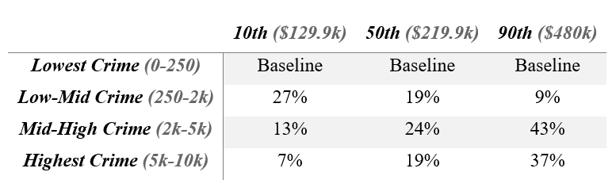

```{r setup, include=FALSE, message=FALSE}
knitr::opts_chunk$set(echo = TRUE)

library(tidyverse)
library(readr)
library(ggplot2)
library(survival)
library(survminer)
library(stargazer)

house <- read_csv("../Source/house_TC.csv")
house <- house %>% mutate(tom = ifelse(tom == 0, 1, tom),
                          prdiff_np = as.factor(prdiff_np))


# Creates Cox-Snell Plot:
CoxSnell = function(cs, status, xlim=NULL, ylim=NULL, main=NULL, sub=NULL) {
  kmcs=survfit(Surv(jitter(cs,amount=(max(cs)-min(cs))/1000),status)~1)$surv
  plot(log(-log(kmcs))~sort(log(cs)),xlab="log(Cox-Snell)",ylab="log(-log(S(Cox-Snell)))",xlim=xlim,ylim=ylim, main=main, sub=sub)
  abline(0,1,col='red') }

house$status <- rep(1, 311)
```


## 1 | Introduction


### 1.1 Background

The real estate market in the Twin Cities (Minneapolis and St. Paul, MN, USA), and many places across the United States, has been thriving on the economic recovery since the end of the Great Recession. While the current market is, to the casual observer, favorable to sellers some houses in Twin Cities still take a surprisingly long time to sell. We will investigate the characteristics that impact time on market (TOM) for houses in the Twin Cities through a survival analysis, or time-to-event, framework.


### 1.2 Review of Literature

\textbf{Price}

One of the most obvious factors that may influence TOM for any house is price. A high price may scare potential buyers away, while a low price might invite skepticism or a long bidding war. Moreover, a high price limits the number of potential buyers even if the price appropriately reflects the quality of the property. The "right" pricing decision is a difficult one to make for sellers and agents, but reaching an equilibrium between buyer and seller satisfaction may be the best way to minimize TOM. Cheng, Lin, and Liu (2008) developed a closed-form formula to uncover the theoretical relationship between price and TOM. They aim to describe the marginal benefit of keeping a house on the market longer.

The authors used house sales data from Fannie Mae and Freddie Mac, U.S. federal mortgage agencies, and identified a nonlinear positive relationship between price and TOM. They approached this analysis by assuming that a buyer and seller arrive at an agreed upon price following the Poisson processes at rate $\lambda$. While utilizing methods from Bond et al. (2007), they investiaged some assumptions about the shape of TOM data, including normal, chi-square, Weibull, and exponential distributions. Like Bond et al. (2007), Cheng, Lin, and Liu (2008) found that the exponential distribution best fit the TOM data$^1$. 

The findings from Cheng, Lin, and Liu's (2008) investigation was that marginal benefit on sale price decreases after each offer that is made on a house$^1$. As a house's price approaches equilibrium between seller and buyer satisfaction, it does the seller little good to leave the house on the market longer.

\textbf{Duration Dependence}

Another interesting question regarding TOM is how the probability of sale changes with time. Thomas W. Zuehlke (1987) conducted research on this very topic. He used 290 single family detached homes obtained from a 1982 multiple listing service (MLS) book in Tallahassee, FL, USA and observed how likely each house was to sell based on its vacancy status. Zuehlke utilized a Weibull hazard model to compare the two and found that sellers of vacant houses have stronger incentives to reduce prices faster than those of occupied houses$^2$. Thus, Zuehlke finds that vacant houses tend to exhibit positive duration dependence, while occupied homes show little evidence of duration dependence. 

Motivated by a Massachusetts state policy adopted in 2006 that prohibits sellers from resetting their home's TOM by relisting, Tucker, Zhang, and Zhu (2013) also investigated the impact of TOM on sale price. The authors agree that longer TOM is negatively associated with buyer perception, which lines up with the Massachusetts relisting policy. To investigate if TOM was indeed a significant deterrent for buyers looking at an otherwise appealing house, the authors analyzed the TOM for homes before and after the enactment of the policy. They obtained listings data for residential properties on the market between January 2005 and June 2007 from two MLSs: MLS-PIN, which serves Massachusetts, and the State-Wide Rhode Island MLS. Their analysis consisted of three groupings of homes: listed and sold before the policy change, listed before and sold after, and listed and sold after$^3$. The authors utilized simple linear regression between the three groups and found that the homes listed before the policy and sold after were most severely impacted, resulting in an average sale price reduction of $16,000$. 

\textbf{Listing Price Changes}

Listing price changes may also affect the TOM for a house. A listing price change could attract more attention to a house on the market, but could also indicate a longer TOM. John R. Knight (2002) conducted an analysis on listing price changes, investigated which types of homes were most likely to go through multiple listing price changes, and which price changes tend to give the worst results for the seller.

Knight used 3490 detached single family homes that sold between January 1997 and December 1998 by Metroservices Inc. of Sacramento, CA, USA. He notes that price adjustment data is generally missing from TOM datasets, but his study incorporated the price changes into the analysis to examine the determinants of list price changes. He utilized a maximum likelihood probit model and found that the two most important determinants of price changes are TOM and initial markup$^4$. Atypical homes tend to not see significant price changes because there is little market precedent for price changes after a certain TOM. Knight's findings are consistent with previous research on pricing under demand uncertainty. 


### 1.3 Research Question (and mapping paragraph)

We are interested in investigating the factors that affect the TOM for a single family homes in the Twin Cities (Minneapolis and Saint Paul) that were sold between July 26, 2017 and February 1, 2018. Some variables of interest include the amount of recorded crime in a house's designated neighborhood and the proximity of a house to the nearest school. 

In the following sections, we outline our data collection and methods and provide a brief description of our assumptions. 

##2 | Data and Methods

### 2.1 Data and Sources

#### Real Estate Data

Our data represents a random sample of 311 single family homes in the Twin Cities that were sold between July 26th, 2017 and February 1st, 2018. A search of all recently sold homes in the area was conducted in the Coldwell Banker MLS and 311 unique addresses were randomly selected for the project. Some variables were scraped directly from the Coldwell Banker site, while others were manually inputted. 

#### Crime Data

We also obtained crime data beginning on January 1, 2015 from the government websites for the cities of Minneapolis and St. Paul$^{5,6}$. Each crime was matched with a neighborhood, aggregated into total neighborhood crime counts, and then joined with the house sales data. This addition will provide insight on the number of crimes that have been recorded over the past three years near each sold house. 

### 2.2 Variables

For all 311 observations, we collected unique addresses `address`, city of residence `city`, zip code `zip`, number of bedrooms `beds`, number of full bathrooms `bathf`, number of partial bathrooms `bathp`, number car garage `carg`, house squarefeet `sqft`, price the home was listed at `listedatpr`, price the home was sold for `soldatpr`, date the home was listed `listedatdate`, date the home was sold `soldatdate`, neighborhood the house is located `neighb`, distance to nearest school (mi.) `schdist`, and number of crimes that were recorded in that neighborhood beginning on January 1, 2015 `ncrime`. We also calculated the time on market `tom` for each house from list date to sale date and included the property ID `pid` from the Coldwell Banker website. 

### 2.3 Assumptions

An essential assumption to our research is based on censoring. We intentionally collected our data from a sample of recently sold houses to limit censoring. If we were to take a true random sample of all houses listed for sale in the past $X$ number of years, we realize that a significant amount of right censoring could be present, because at the time of data collection some houses in our sample would have not been sold yet. We acknowledge that sampling from a set of recently sold houses may introduce some bias into our results - all recently sold houses in this particular date range (late January to early Februray 2018) may share certain unknown or unaccounted-for characteristics that made them sell. This bias is acceptable considering the convenience and added accuracy provided by uncensored data.

### 2.4 Methods

We first utilize nonparametric Kaplan-Meier curves to investigate relationships between time on market and certain variables like distance to the nearest school, crime in the home's neighborhood since 2015, list price, and municipal location. For crime and list price, it was necessary to create categorical variables to properly analyze their effect on time on market with some level of singificance and interpretability. 

Next, we construct univariate parametric accelerated failure time models for each of the variables mentioned previously. We deploy two distribution families - the Weibull and log-normal distributions - and assess which model fits the data better primarily using the (Akaike Information Criterion) AIC, with some assistance from Cox-Snell residual plots. We utilize this comparison approach throughout our analysis as it allows us to observe the impact of a parametric assumption and determine the overall significance of the models we are using, whether they are univariate or multivariate. 

We also fit a multivariate model using each of the variables mentioned above except city, as it appeared to have no significant relationship with time on market. Such an approach allowed us to control for multiple variables at once and see how each of their behavior changed in the presence of the others. With this multivariate strategy in mind, we also considered the possible interaction between list price and crime, as people living in higher crime areas may have to price their homes lower in order to sell. 

Finally, throughout our analysis we employed Cox's Proportional Hazards model as a comparison tool to parametric methods. Since these models assume proportional hazard ratios between the baseline and covariates included, we also asses each proportional hazard assumption using Schoenfeld residual plots.

##3 | Results

We begin our preliminary analysis by investigating the length of time that houses in the Twin Cities remain on the market after their preliminary listing date.

### 3.1 Non-Parametric (Kaplan-Meier) Survival Curve Estimates 

#### Proximity to Nearest School

Kaplan-Meier curves allow us to observe the general trends in the data, with time on market being the most important variable in the analysis. Our parametric analysis that follows will be informed by basic insights obtained from these Kaplan-Meier curves. 

First, we fit a Kaplan-Meier curve for time on market by distance from the nearest school ($Figure \hspace{0.1cm} 1 $). In order to do this, we identify the closest 50% of homes as "close" and the farthest 50% of homes as "far."

$ Figure \hspace{0.1cm} 1 $

```{r echo=FALSE}
house$schdistCat <- cut(house$schdist, breaks = quantile(house$schdist, probs=c(0, .5, 1)))
KM0 <- survfit(Surv(tom) ~ schdistCat, conf.type="plain", data=house)
ggsurvplot(KM0, data=house, legend.labs=c("Near", "Far"), xlim=c(0,230)) + 
  labs(x = "Days on Market", y = "Survival Probability", title="Days on Market by Proximity to Nearest School")
```

There appears to be no difference based on distance to school. However, this may be due to the over-generalization (near vs. far) of school distance. This variable warrants further investigation. 

#### Crime 

Next, we fit a Kaplan-Meier curve for time on market based on number of crimes committed in that house's neighborhood since the beginning of 2015 $Figure \hspace{0.1cm} 2 $. 

$Figure \hspace{0.1cm} 2 $

```{r echo=FALSE}
house$crimeCat2 = cut(house$ncrime, breaks = c(0,250,2000,5000,10000))
KM = survfit( Surv(tom) ~ crimeCat2, conf.type="plain" , data=house ) 
ggsurvplot(KM, data=house, legend.labs=c("0 to 250 crimes", "250 to 2000", "2000 to 5000", "5000 to 10000"), xlim=c(0,230)) +
  labs(x = "Days on Market", y = "Survival Probability", title = "Days on Market by Crime Since 2015 Category")
```


We see that homes that fit into the second highest number of crimes category take the longest to sell, while homes in the lowest crime neighborhoods sell fastest. This progression seems logical, except for homes in the highest crime neighborhoods, which appear to sell generally the second fastest. This is likely because these homes in the highest crime category may be cheap enough to attract more home buyers and therefore stay on market shorter.

#### List Price

Now, we look at the Kaplan-Meier curve to see how TOM changes based on the list price categories ($Figure \hspace{0.1cm} 3 $). 

$Figure \hspace{0.1cm} 3 $

```{r echo=FALSE}
house$listedatprCat = cut(house$listedatpr, breaks = quantile(house$listedatpr, probs=c(0, .33, .67, 1)))
KM1 = survfit( Surv(tom) ~ listedatprCat , conf.type="plain" , data=house ) 
ggsurvplot(KM1, data=house, legend.labs=c("price = 63,000 to 180,000", "180,000 to 275,000", "275,000 to 1,300,000"), xlim=c(0,230)) +
  labs(x = "Days on Market", y = "Survival Probability", title = "Days on Market by List Price Category")
```

Houses that fall into the highest price category appear to take the longest to sell, while houses in the middle price category appear to sell the fastest. One explanation for this relationship is that while people prefer good quality homes which is reflected in the list price, not many people are able to afford the most expensive homes, and diminishing marginal utility may be in play. Homes in the cheapest price category have a longer TOM compared to those in the middle category because the cheap price reflects lower home quality, perhaps with potential defects unknown to buyers. Another aspect of the curves is that the survival differences in list price are minimal in the earlier times, become larger as the curves approach 3 months, and decrease back again toward 5 months and onward. This pattern indicates that survival differences among houses in various list price categories change over time.


#### City

Finally, we examine the effect of municipal locations on TOM through Kaplan-Meier ($Figure \hspace{0.1cm} 4 $). 

$Figure \hspace{0.1cm} 4 $

```{r echo=FALSE}
KM2 = survfit( Surv(tom) ~ city , conf.type="plain" , data=house ) 
ggsurvplot(KM2, data=house, legend.labs=c("Minneapolis", "St. Paul"), xlim=c(0,230)) +
  labs(x = "Days on Market", y = "Survival Probability", title = "Days on Market by City")
```

St. Paul homes seem to take slightly longer to sell compared to Minneapolis homes based on this Kaplan-Meier curve. While this relationship may seem negligible, this small difference warrants further investigation in parametric models. 

Now that we have taken a brief look at Kaplan-Meier curves for these variables, we will create some models with parametric assumptions to verify or refute previously observed trends by assessing for significant relationships. 


### 3.2 Univariate Parametric Models

#### Proximity to Nearest School

The Kaplan-Meier curve shown in the previous section revealed what appears to be no difference in how long a house takes to sell based on its municipal designation. In order to verify the previous graphical findings, we create three different models to further assess the impact of school distance on time to sale. 

```{r include=FALSE}
mw = survreg( Surv(tom) ~ schdist , dist = "weibull" , data = house )
mln = survreg( Surv(tom) ~ schdist , dist = "lognormal" , data = house )
mcox = coxph( Surv(tom) ~ schdist , data = house )

summary(mw) # the sign of schdist makes sense (positive) and it is significant
summary(mln) # the sign of schdist is negative and it is NOT significant
mcox # sign agrees with weibull and it is significant
```

```{r include=FALSE}
exp(0.246)
exp(-0.0313)
```

The Weibull model indicates that the TOM is 28% longer on average for every mile increase in the distance to the closest school with a significant p-value at 0.00486. However, the log-normal model yields the opposite result with 3% shorter TOM with a highly insignificant p-value at 0.77. This result may be due to the inherent differences in the two models, rather than the school distance variable being insignificant, as a number of literature deem school distance as an important factor affecting TOM of a property. In addition, the Cox PH model agrees with the Weibull model in the variable's direction and p-value. According to the Cox PH model, the hazard ratio of school distance is 0.701, which means that the risk of being sold decreases by 30% for every one mile increase in school distance. In other words, properties farther away from schools take longer to sell.


```{r include = FALSE}
# Create Cox-Snell residuals
CS_w = -log( 1 - pweibull(house$tom, 1/0.537, exp(4.443 + 0.246*house$schdist) ) )
CS_ln = -log( 1 - plnorm(house$tom, 4.3010 + -0.0313*house$schdist, 0.623) ) 
```

$Figure \hspace{0.1cm} 5 $

```{r echo=FALSE} 
CoxSnell( CS_w , house$status, main="Weibull School Distance C-S Resids" )
```

$Figure \hspace{0.1cm} 6 $

```{r echo=FALSE}
CoxSnell( CS_ln , house$status ,xlim=c(-7,5), main="Log-normal School Distance C-S Resids")
```

The Cox-Snell residuals select log-normal as the better model since the residuals fit the line with intercept 0 and slope 1 better ($Figure \hspace{0.1cm} 5, 6 $). The same trend holds for the following univariate models, so we show Cox-Snell residuals only for school distance.

```{r include = FALSE}
2*(3-mw$loglik[2]) # mw
2*(3-mln$loglik[2]) # mln

# The AIC for the Weibull model is 3242.878, and that for the log-normal model is 3258.564. Thus, we conclude that the Weibull model fits better than the log-normal model. 
```

AIC indicates that the Weibull model is a better fit. This contradiction between Cox-Snell residual plots and AIC could be attributed to different calculation methods, as Cox-Snell residuals do not consider number of parameters like AIC does. This is merely speculation, though. We do not know the actual reason for this contradition.

#### Crime 

```{r include=FALSE}
house$crimeCat2 = cut(house$ncrime, breaks = c(0,250,2000,5000,10000))

mw = survreg( Surv(tom) ~ crimeCat2, dist = "weibull" , data = house )
mln = survreg( Surv(tom) ~ crimeCat2, dist = "lognormal" , data = house )
mcox = coxph( Surv(tom) ~ crimeCat2, data = house )

summary(mw)
summary(mln)
mcox
```

Crime as a continuous variable was insignificant for all three models. Thus, we analyze the effect of crime as a categorical variable to allow detection of a possible non-linear trend. Our categorical crime variable has four groups: crime count ranging from 0 to 250, 250 to 2000, 2000 to 5000, and 5000 to 10000.  

In the Weibull model, the 250-2000 crime group has TOM that is 14% longer than the 0-250 crime group, and the next group, the 2000-5000 crime group, has more than double the TOM of the previous group at 33%. While the p-value for 250-2000 crime group is at borderline significance ($p = .0872$), that for the 2000-5000 crime group is significant at the 5% level ($p = .00554$). The fact that the houses in the neighborhoods with less crime (250-2000) would sell faster than those in the neighborhoods with more crime (2000-5000) makes sense since people generally prefer neighborhoods with less crime. 

On the other hand, the highest crime group (5000-10000) shows almost no difference in TOM compared to the lowest crime group (time ratio = $1.039$), and its p-value is highly insignificant ($p = .668$). This result is possibly due to the fact that properties located in high-crime neighborhoods tend to be discounted to reflect high crime levels. 

The Cox PH model agrees with the Weibull model. The hazard ratio for the 250-2000 crime group is approximately 19% less than that of the 0-250 crime group ($p = .1736$), and that for the 2000-5000 group is approximately 36% less than that of the 0-250 crime group ($p = .0056$). Finally, the hazard ratio for the 5000-10000 crime group is only about 6% lower than the 0-250 crime group, again with insignificant p-value ($p = .7296$). The log-normal model too is insignificant for all crime categories with weaker effect sizes. 

```{r include = FALSE}
CS_w = -log( 1 - pweibull(house$tom, 1/0.533, exp(4.45486375 +  0.13794492*(house$crimeCat2=="(250,2e+03]") + .28846076*(house$crimeCat2=="(2e+03,5e+03]") +   0.03853525*(house$crimeCat2=="(5e+03,1e+04]")     ) ) )
CS_ln = -log( 1 - plnorm(house$tom, 4.3010 + -0.0313*house$schdist, 0.623) ) 
```

```{r echo=FALSE, include=FALSE}
#CoxSnell( CS_w , house$status, main="Weibull Crime Category C-S Resids")
#CoxSnell( CS_ln , house$status, main="log-normal Crime Category C-S Resids")
```

```{r include = FALSE}
2*(3-mw$loglik[2]) # mw
2*(3-mln$loglik[2]) # mln
```

Again, the AIC indicates that the Weibull model is a better fit than the log-normal model. 


#### List Price

```{r include=FALSE}
mw = survreg( Surv(tom) ~ log(listedatpr), dist = "weibull" , data = house )
mln = survreg( Surv(tom) ~ log(listedatpr), dist = "lognormal" , data = house )
mcox = coxph( Surv(tom) ~ log(listedatpr), data = house )

summary(mw)
summary(mln)
mcox
```

```{r include = FALSE}
exp(0.120) #w
exp(0.189) #ln
# If the price triples (mult by 2.81 or exp(1)), the probability of being sold is multiplied by 0.768. (Victor)
```

```{r include=FALSE} 
listedatpr_quant = quantile(house$listedatpr, c(0, 0.10, 0.5, 0.9, 1))

# qplot(log(house$listedatpr))
sort(log(house$listedatpr))

logpr_10 = log(listedatpr_quant[[2]])
logpr_50 = log(listedatpr_quant[[3]])
logpr_90 = log(listedatpr_quant[[4]])

exp(0.120*logpr_10) #w 10th percentile !!! I don't know how to interpret this
exp(0.120*logpr_50) #w 50th percentile
exp(0.120*logpr_90) #w 90th percentile

exp(0.189*logpr_10) #ln 10th percentile
exp(0.189*logpr_50) #ln 50th percentile
exp(0.189*logpr_90) #ln 90th percentile
```

Properties with higher list prices tend to have a longer TOM at the 5% significance level for both Weibull and the log-normal models. The effect is stronger with the log-normal model at 20% longer TOM ($p=.0043$) for every increase in the log of list price compared to 12% longer TOM for the Weibull model with a slightly lower significance ($p=.0348$). To put these numbers into perspective, we can say that every time price multiplies by 2.81, TOM increases by 12% and 20% for the Weibull and log-normal model, respectively. The effect sizes indicate that the TOM is largely insensitive to list price. !!!(Victor) Finally, according to the Cox PH model the probability of sale decreases by 33% ($p=.011$). These results are consistent with the logic that a more expensive home will take longer to sell due to financial constraints and diminishing marginal utility. The AIC yields a stronger evidence in support of the Weibull model over the log-normal model by a slight margin, which could indicate that the log-normal model is overplaying the impact that list price has on time to sale. 

```{r include = FALSE}
2*(3-mw$loglik[2]) # mw
2*(3-mln$loglik[2]) # mln
```

#### City

```{r include=FALSE}
mw = survreg( Surv(tom) ~ city, dist = "weibull" , data = house )
mln = survreg( Surv(tom) ~ city, dist = "lognormal" , data = house )
mcox = coxph( Surv(tom) ~ city, data = house )

summary(mw)
summary(mln)
mcox
```

```{r include = FALSE}
exp(0.101)
exp(0.0602)
```

In the Weibull model, city of St. Paul has a positive coefficient with a borderline insignificant p-value ($p=.107$), indicating that properties in St. Paul on average has 11% longer TOM compared to those in Minneapolis. The log-normal model, on the other hand, was not at all significant with a very small effect. The Cox PH is in line with the Weibull model with hazard ratio of St. Paul to Minneapolis at 0.86 ($p=.19$). This hazard ratio illustrates that the chance of being sold for a house in St. Paul is 14% less than that for a house in Minneapolis, which translates into a longer TOM for a house in Saint Paul than that in Minneapolis. The AIC selects Weibull.


```{r include = FALSE}
mw$coefficients
mln$coefficients
# Create Cox-Snell residuals
house$cityn = ifelse(house$city == "Minneapolis", 1, 0)
CS_w = -log( 1 - pweibull(house$tom, 1/0.548101, exp(4.5292418 + 0.1006498*house$cityn  ))) 
CS_ln = -log( 1 - plnorm(house$tom, 4.25681878 + 0.06020683*house$cityn, 0.6219641 ) ) 
```

```{r echo=FALSE}
#CoxSnell( CS_w , house$status )
#CoxSnell( CS_ln , house$status )
```

```{r include = FALSE}
2*(3-mw$loglik[2]) # mw
2*(3-mln$loglik[2]) # mln
```


### 3.3 Multivariate Parametric Models

#### School Distance, Crime Category, and List Price Without Interaction Term

```{r include=FALSE}
mw = survreg( Surv(tom) ~ schdist + crimeCat2 + log(listedatpr) , dist = "weibull" , data = house )
mln = survreg( Surv(tom) ~ schdist + crimeCat2 + log(listedatpr) , dist = "lognormal" , data = house )
mcox = coxph(Surv(tom) ~ schdist + crimeCat2 + log(listedatpr) , data = house )

summary(mw) 
summary(mln) 
mcox
```

```{r include=FALSE}
exp(0.184)
exp(0.131)
```

According to the Weibull model in Table 1 in the Appendix, all variables are significant with expected signs except for the highest crime category. Consistent with the univariate models, every unit increase in school distance and log of list price lengthen TOM by 20% and 14%, respectively. In other words, homes with the higher list price or and those farther away from schools tend to stay on market longer. The directions with these variables are logical. Besides income limitations and decreasing utility per every dollar increase in list price, expensive houses are harder to sell because they may often be overpriced at more than their appraisal values. On the other hand, houses closer to schools tend to be in more populated and desirable areas, so it should follow that houses closer to a school would sell faster. Moreover, the kind of buyers who purchase homes near schools may have kids and therefore tend to purchase homes faster.

All crime categories predict longer TOM compared to the lowest crime category, which is mostly consistent with the univariate crime category analysis previously conducted. Specifically, the second crime group is more likely to stay on market longer compared to the lowest crime group in line with the univariate model. However, the TOM for the third crime group is less than double that for the second crime group, which is a weaker effect than what we observed in the univariate analysis. For example, houses that belong to the second and third crime category on average have 21% and 29% longer TOM, respectively, compared to those in the lowest crime category. On the other hand, the highest crime category indicates only 11% longer TOM compared to the lowest crime group with an insignificant p-value. With respect to p-values, both the second and third group are now significant at the 5% level, and the p-value for the highest crime group improved by a factor of 3. The log-normal model and Cox PH model agree with Weibull but the log-normal model was far less significant overall. 

Consistent with our univariate models, the multivariate Cox PH model in $Figure \hspace{0.1cm} 8 $ illustrates that longer distance to school and higher list price lowers the chance of a home being sold and that homes in higher crime categories are also generally less likely to be sold compared to homes in the lowest crime category. Although school distance and the highest crime category are insignificant, the overall directions are consistent with Weibull.  

```{r include=FALSE}
summary(mw)
mw$coefficients
edays_crimeCat2_1 = exp(2.712 + 0.1843770*mean(house$schdist) + 0.1309947*mean(log(house$listedatpr)))
edays_crimeCat2_2 = exp(2.712 + 0.1843770*mean(house$schdist) + 0.1876134*1 + 0.2515044*0 + 0.1093053*0 + 0.1309947*mean(log(house$listedatpr)))
edays_crimeCat2_3 = exp(2.712 + 0.1843770*mean(house$schdist) + 0.1876134*0 + 0.2515044*1 + 0.1093053*0 + 0.1309947*mean(log(house$listedatpr)))
edays_crimeCat2_4 = exp(2.712 + 0.1843770*mean(house$schdist) + 0.1876134*0 + 0.2515044*0 + 0.1093053*1 + 0.1309947*mean(log(house$listedatpr)))

(tr_21 = edays_crimeCat2_2/edays_crimeCat2_1)
(tr_31 = edays_crimeCat2_3/edays_crimeCat2_1)
(tr_41 = edays_crimeCat2_4/edays_crimeCat2_1)

# time ratio matches with above
# check with Nick and Victor!!!
exp(0)
exp(0.1876134*1) # houses that belong to crime group 2 on average have 21% longer TOM compared to those that belong to crime group 1
exp(0.2515044*1)
exp(0.1093053*1)

crimeCat2_1 = function(x) 1-pweibull(x,1/0.528,exp(2.712 + 0.1843770*mean(house$schdist) + 0.1309947*mean(log(house$listedatpr))))
crimeCat2_2 = function(x) 1-pweibull(x,1/0.528,exp(2.712 + 0.1843770*mean(house$schdist) + 0.1876134*1 + 0.2515044*0 + 0.1093053*0 + 0.1309947*mean(log(house$listedatpr))))
crimeCat2_3 = function(x) 1-pweibull(x,1/0.528,exp(2.712 + 0.1843770*mean(house$schdist) + 0.1876134*0 + 0.2515044*1 + 0.1093053*0 + 0.1309947*mean(log(house$listedatpr))))
crimeCat2_4 = function(x) 1-pweibull(x,1/0.528,exp(2.712 + 0.1843770*mean(house$schdist) + 0.1876134*0 + 0.2515044*0 + 0.1093053*1 + 0.1309947*mean(log(house$listedatpr))))

integrate(crimeCat2_1,0,Inf)
integrate(crimeCat2_2,0,Inf)
integrate(crimeCat2_3,0,Inf)
integrate(crimeCat2_4,0,Inf)

# Extra interpretation

# find Pr(days > 100) for the crime group 1
1-pweibull(100, 1/0.528, exp(2.712 + 0.1843770*mean(house$schdist) + 0.1309947*mean(log(house$listedatpr)))) # probability that the house will stay on market for 100 or more days if the house is in crime group 1 = 25%

# At what time point does the survival curve for the crime group 2fall to the same value as in above?
qweibull(1-0.2490305, 1/0.528, exp(2.712 + 0.1843770*mean(house$schdist) + 0.1876134*1 + 0.2515044*0 + 0.1093053*0 + 0.1309947*mean(log(house$listedatpr))))

# the above is the same as the following:
100*exp(0.1876134*1) # how many days would it take a house in crime group 2 to reach 25% probability of staying on market for more than 100 days?
100*exp(0.2515044*1) # how many days would it take a house in crime group 3 to reach 25% probability of staying on market for more than 100 days?
100*exp(0.1093053*1) # how many days would it take a house in crime group 4 to reach 25% probability of staying on market for more than 100 days?

## Note: look at differences in days
```

$Figure \hspace{0.1cm} 8 $

*Summary of Cox PH Model*

```{r echo=FALSE, include=FALSE}
library(survminer)
mcox = coxph(Surv(tom) ~ schdist + crimeCat2 + log(listedatpr) , data = house )
mcox
```

```{r echo=FALSE, warning=FALSE}
ggforest(mcox, data = house)
```


$Figure \hspace{0.1cm} 9 $ is a survival comparison of the crime categories. As mentioned previously, the highest crime category and the lowest crime category differ the least in survival.

$Figure \hspace{0.1cm} 9 $

```{r echo = FALSE}
# crime gp 1
curve(1-pweibull(x,1/0.528,exp(2.712 + 0.1843770*mean(house$schdist) + 0.1309947*mean(log(house$listedatpr)))),col='black',xlim=c(0,150),ylab="Probability of Sale", xlab = "Days", main = "TOM for Crime Categories") 

# crime gp 2
curve(1-pweibull(x,1/0.528,exp(2.712 + 0.1843770*mean(house$schdist) + 0.1876134*1 + 0.2515044*0 + 0.1093053*0 + 0.1309947*mean(log(house$listedatpr)))),col='purple',xlim=c(0,150),ylab="Survival",add=TRUE)

# crime gp 3
curve(1-pweibull(x,1/0.528,exp(2.712 + 0.1843770*mean(house$schdist) + 0.1876134*0 + 0.2515044*1 + 0.1093053*0 + 0.1309947*mean(log(house$listedatpr)))),add=TRUE,col='blue',lty=1)

# crime gp 4
curve(1-pweibull(x,1/0.528,exp(2.712 + 0.1843770*mean(house$schdist) + 0.1876134*0 + 0.2515044*0 + 0.1093053*1 + 0.1309947*mean(log(house$listedatpr)))),add=TRUE,col='red',lty=1)

legend(0.5,0.35,c("0 to 250 crimes", "250 to 2000 crimes", "2000 to 5000 crimes", "5000 to 10000 crimes"),col=c("black","purple", "blue", "red") , text.col=c("black","purple", "blue", "red") , lty=1 , cex=0.8 ) 
# time ratio
```


#### Model Selection

Now, we select the model by first plotting the Cox-Snell residuals for the Weibull and log-normal models ($Figure \hspace{0.1cm} 10,11 $) and then comparing the AIC calculations for each model. Utilizing both a graphical and analytical approach to assessing model fit will help ensure thorough vetting of models. 


*Cox-Snell Residuals*

```{r echo=FALSE, include=FALSE}
mln$coefficients
# Create Cox-Snell residuals
CS_w = -log( 1 - pweibull(house$tom, 1/0.532846, exp(2.7119300 + 0.1843770*house$schdist +
                                                       0.1876134*(house$crimeCat2=="(250,2e+03]") +
                                                       0.2515044*(house$crimeCat2=="(2e+03,5e+03]") +
                                                       0.1093053*(house$crimeCat2=="(5e+03,1e+04]") +
                                                       0.1309947*log(house$listedatpr))))
CS_ln = -log( 1 - plnorm(house$tom, 1.37373386 + -0.04454097*house$schdist + 0.09386602*(house$crimeCat2=="(250,2e+03]") +
                           0.22584417*(house$crimeCat2=="(2e+03,5e+03]") + 0.16964559*(house$crimeCat2=="(5e+03,1e+04]") +
                           0.22797669*log(house$listedatpr), 0.6088315)) 

```

$Figure \hspace{0.1cm} 10 $

```{r echo=FALSE}
# Make appropriate graph using CoxSnell function
CoxSnell( CS_w , house$status , main = "Weibull Cox-Snell Residuals")
```

$Figure \hspace{0.1cm} 11 $

```{r echo=FALSE}
CoxSnell( CS_ln , house$status , main = "Log-normal Cox-Snell Residuals")
```

The log-normal model appears to perform better when evaluating the Cox-Snell residual plots. However, the AIC prefers the Weibull model.

```{r echo=FALSE, include=FALSE}
2*(10-mw$loglik[2]) # mw
2*(10-mln$loglik[2]) # mln
```


#### School Distance, Crime Category, and List Price with Interaction Term 

```{r echo=FALSE, include=FALSE}
mw = survreg( Surv(tom) ~ schdist + crimeCat2 + log(listedatpr) + crimeCat2:log(listedatpr), dist = "weibull" , data = house )
mln = survreg( Surv(tom) ~ schdist + crimeCat2 + log(listedatpr) + crimeCat2:log(listedatpr), dist = "lognormal" , data = house )
mcox = coxph(Surv(tom) ~ schdist + crimeCat2 + log(listedatpr) + crimeCat2:log(listedatpr), data = house )

summary(mw) 
summary(mln) 
mcox
```

Now, we include the interaction term between crime categories and list price as presented in Table 2 in the Appendix. In the Weibull model with interaction, all terms are insignificant except for school distance, possibly due to significantly increased degrees of freedom. However, the insignificant p-values do not concern us as our aim is to examine the effect of list price on TOM controlling for crime rates in the neighborhood. 

For interpretations, we pick three representative list price values to show how the probability of sale changes with respect to different crime categories at each of these list prices (Table 3). The three prices are the 10th, 50th, and 90th percentile of the list price at \$129,900,  \$219,900, and \$480,000, respectively. First, among houses priced at the 10th percentile (\$129,900), those in the second crime category show a significant increase in TOM (27%) compared to those in the lowest crime category, while those in the highest crime category show almost no change in TOM (7%). However, as the list price increases to the 50th percentile (\$219,900), we see that homes in the second and the highest crime categories increase in TOM by about the same amount compared to those in the lowest crime category. Finally, if a house is priced at the 90th percentile (\$480,000), the second and lowest crime category do not differ much in TOM (9%), while the third and highest crime category project a significantly increased TOM (43% and 37%, respectively) compared to the lowest crime category. These results suggest that the houses in the lowest and highest crime neighborhoods that have a small difference in TOM are also the cheapest in price and that as price rises, the difference in TOM between the homes in the lowest and the highest crime categories tend to magnify. As previously mentioned, houses in the highest crime neighborhoods sell about as fast as those in the lowest crime neighborhoods because of the low list price.

$Table \hspace{0.1cm} 3$



```{r include=FALSE} 
listedatpr_quant = quantile(house$listedatpr, c(0, 0.10, 0.5, 0.9, 1))

logpr_10 = log(listedatpr_quant[[2]])
logpr_50 = log(listedatpr_quant[[3]])
logpr_90 = log(listedatpr_quant[[4]])

# 10th percentile
### logpr_10 = 11.77452
exp(1.666-0.121*logpr_10)
exp(-1.984+.179*logpr_10)
exp(-2.118+.186*logpr_10)

# 50th percentile
### logpr_50 = 12.30093
exp(1.666-0.121*logpr_50)
exp(-1.984+.179*logpr_50)
exp(-2.118+.186*logpr_50)

# 90th percentile
### logpr_90 = 13.08154
exp(1.666-0.121*logpr_90)
exp(-1.984+.179*logpr_90)
exp(-2.118+.186*logpr_90)
```

The log-normal model is insignificant with inconsistent effect sizes, and the Cox PH model again agrees with Weibull.


#### Model Selection

As with the previous multivariate model, Cox-Snell favors log-normal, while the AIC favors Weibull.

```{r echo=FALSE, include=FALSE}
2*(10-mw$loglik[2]) # mw
2*(10-mln$loglik[2]) # mln
```

Now, when we compare the first multivariate model to the interaction model for Weibull and log-normal, respectively, using the Liklihood Ratio Test (LRT), we find that including the interaction term between crime categories and list price is not significant in the Weibull model but significant in the log-normal model. For Weibull, some of the signs and significance of the covariates were sensitive to the inclusion of the interaction term, which explains the insignificant p-values of the LRT. For log-normal, one must keep in mind that the original multivariate log-normal model was insignificant with questionable signs to begin with, so even if the model that includes the interaction term has a lot larger log liklihood, it is likely to be inaccurate. Again, we decide to include the Weibull interaction model despite its insignificance because we are interested in seeing the effect of crime rates on TOM when adjusting for list price.

```{r echo=FALSE, include=FALSE}
### LRT (April added this. Nick, please look !!!)

#### Weibull
mw0 = survreg( Surv(tom) ~ schdist + crimeCat2 + log(listedatpr) , dist = "weibull" , data = house ) # original multivar
mw3 = survreg( Surv(tom) ~ schdist + crimeCat2 + log(listedatpr) + crimeCat2:log(listedatpr) + crimeCat2:schdist, dist = "weibull" , data = house ) # full interaction

#### Weibull LRT
ts = 2*(mw$loglik[2]-mw0$loglik[2]) # mw
1 - pchisq( ts , df=3 ) # not significant

ts = 2*(mw3$loglik[2]-mw0$loglik[2]) # mw
1 - pchisq( ts , df=6 ) # significant

ts = 2*(mw3$loglik[2]-mw$loglik[2]) # mw
1 - pchisq( ts , df=3 ) # significant


#### Log-normal
mln0 = survreg( Surv(tom) ~ schdist + crimeCat2 + log(listedatpr) , dist = "lognormal" , data = house )
mln3 = survreg( Surv(tom) ~ schdist + crimeCat2 + log(listedatpr) + crimeCat2:log(listedatpr) + crimeCat2:schdist, dist = "lognormal" , data = house )

#### Log-normal LRT
ts = 2*(mln$loglik[2]-mln0$loglik[2]) # mln
1 - pchisq( ts , df=3 ) # significant

ts = 2*(mln3$loglik[2]-mln$loglik[2]) # mln
1 - pchisq( ts , df=3 ) # significant

# length(mw$coefficients)-length(mw0$coefficients)
summary(mln0)
summary(mln)
summary(mln3)

2*(10-mw3$loglik[2]) # mw
2*(10-mln3$loglik[2]) # mln
```

```{r echo=FALSE, include=FALSE}
# *Summary of Cox PH Model*
library(survminer)
mcox = coxph(Surv(tom) ~ schdist + crimeCat2 + log(listedatpr) + crimeCat2:log(listedatpr), data = house )
mcox
```

```{r include = FALSE}
#stargazer(house[c(9,14,22),])
#stargazer(house[c(9,14,22),], summary=FALSE, rownames=FALSE)
stargazer(mw, mln, title="Results", align=TRUE)
#stargazer(mcox, title="Results", align=TRUE)
```


### 3.4 Testing the Cox PH Assumption

To test the PH assumption, we turn to examining the Schoenfeld residuals of our multivariate model ($Figures $ 12-16).

#### Multivariate Assessment of the PH Assumption

```{r echo = FALSE}
mcox = coxph(Surv(tom) ~ schdist + crimeCat2 + log(listedatpr), data=house)
# plot( cox.zph(mcox) , main = "Schoenfeld Residuals")
#cox.zph( mcox )
```

$Figure \hspace{0.1cm} 12 $

```{r echo = FALSE}
plot( cox.zph(mcox)[1] , main = "Schoenfeld Residuals: School Distance")
```

$Figure \hspace{0.1cm} 13 $

```{r echo = FALSE}
plot( cox.zph(mcox)[2] , main = "Schoenfeld Residuals: Second Crime Category")
```

$Figure \hspace{0.1cm} 14 $

```{r echo = FALSE}
plot( cox.zph(mcox)[3] , main = "Schoenfeld Residuals: Third Crime Category")
```

$Figure \hspace{0.1cm} 15 $

```{r echo = FALSE}
plot( cox.zph(mcox)[4] , main = "Schoenfeld Residuals: Highest Crime Category")
```

$Figure \hspace{0.1cm} 16 $

```{r echo = FALSE}
plot( cox.zph(mcox)[5] , main = "Schoenfeld Residuals: Log of the List Price")
```


According to the Schoenfeld residuals, PH assumption seems to be valid for crime categories, while it does not hold for both school distance and list price. For school distance, the Schoenfeld residuals show a decreasing trend, while the list price Schoenfeld residuals increase with respect to time. More specifically, school distance has a strong positive effect in the beginning, which gradually decreases until about 45 days, and becomes ineffective afterwards. On the other hand, list price has a strong negative effect in the beginning, which slowly increases throughout the first three months and convergest to 0 afterwards. In other words, school distance mostly has a positive effect on TOM but the effect is valid only for the first 45 days, while list price mostly shows a negative effect on TOM which is valid only for the first three months. However, one should note that the strong positive effect observed in the school distance residuals is due to the three outliers in the data. In fact, when these outliers are removed, PH assumption seemed to hold for school distance as well. Although removing outliers is usually not encouraged, it can be helpful in explaining the violation of PH assumption. List price showing negative trend for the first three months may be due to wealth constraints as well as a possible defect in the property contingent on the duration on the market. However, this should not be of concern, as we are mainly interested in the effects in the first three months. Overall, only the list price seems to violate the PH assumption.


##4 Conclusions and Discussion

In summary, we observed some fascinating trends in the time a Twin Cities home spends on the market when controlling for variables such as distance to nearest school, list price, crime in neighborhood since 2015, and municipal location. 

First, our data indicate that houses closer to the nearest school tend to sell faster, likely due to the more convenient and/or central location. We also observed that houses priced higher tend to take longer to sell, likely because higher prices are self-selective of buyers. We also believe that houses with higher prices are more likely to be overpriced relative to their appraised value. We also observed that houses in neighborhoods with a higher number of crimes since the start of 2015 take longer to sell, with the exception of houses in the highest crime neighborhoods. This phenomena was explained by the crime and list price interaction model where we observed that cheaper houses in higher crime neighborhoods generally having similar TOM to houses in the lowest crime neighborhoods. Finally, in a broader look at time on market compared to municipal location, we did not observe a significant relationship between how long a home took to sell and whether a house is located in Minneapolis or St. Paul. 

Our Cox Proportional Hazards models for each variable revealed similar trends to our parametric models, though p-values were generally not significant with the exception of the second highest crime category, which showed a significantly decreased risk of selling the home compared to the lowest crime level. However, it is important to remember that insignificant p-values in a Cox Proportional Hazards model do not warrant ending the investigation since the proportional hazards assumption made in the model must be assessed. 

Our multivariate model verified our findings from the univariate models, including that more expensive houses tend to take longer to sell and houses in areas with higher crime also tend to stay on the market longer, though we did observe a weaker effect on TOM for the second-highest tier of neighborhood crimes. 

Our next thought was that an interaction may exist between the number of neighborhood crimes and list price, and our interaction model revealed in both the Weibull and log-normal cases that there is an interaction. We observed that the crime category that a house was associated with impacted the time on market for homes within the first 2 months of being listed on the market, and after that time the difference was negligible. The biggest effect was observed between the lowest level of crime and the next step up.  

The multivariate Cox Proportional Hazards model also verified our initial observations, including increased time on market when: distance from the nearest school increases, crime increases (especially for the second and third levels of crime), and the log of the list price increases. We also created the same proportional hazards assumption for the interaction model, which revealed some drastically different results with no significant p-values. Since not all of these p-values were significant, further investigation into the proportional hazards assumption was warranted. 

Our assessment of the proportional hazards assumptions generally resulted in declaring a valid proportional hazards assumption, with the exception of list price category, which showed an especially strong positive trend in Schoenfeld residuals for the most expensive group of houses. This indicated to us that the impact of a higher list price on a house diminishes over time. 

While our insights are generally not groundbreaking, they serve to produce an important base understanding for the interaction of the real estate market with the environment around it. We also believe that the results show some important aspects of consumer economic behavior. Hopefully our conclusions will help home buyers, sellers, and real estate agents alike to establish clear expectations for how long a home will remain on the market based on a variety of factors surrounding the listing. 


\clearpage

\onecolumn

##5 References


1. Cheng, P., Lin, Z., & Liu, Y. (2008). A Model of Time-on-Market and Real Estate Price Under Sequential \ \ \ Search with Recall. \textit{Real Estate Economics}, 36(4), 813-843. 

2. Zuehlke, T. W. (1987). Duration Dependence in the Housing Market. \textit{The Review of Economics and \ \ \ Statistics}, 69(4), 701. 

3. Tucker, C., Zhang, J., & Zhu, T. (2012). Days on Market and Home Sales. \textit{SSRN Electronic Journal}.

4. Knight, J. R. (2002). Listing Price, Time on Market, and Ultimate Selling Price: Causes and Effects of \ \ \ Listing Price Changes. Real Estate Economics, 30(2), 213-237.

5. Crime Incident Report - Dataset | Open Data | St Paul. (2016, April 3). Retrieved February 1, 2018, \ \ \ from https://information.stpaul.gov/Public-Safety/Crime-Incident-Report-Dataset/gppb-g9cg

6. Neighborhood Crime Statistics | City of Minneapolis. (n.d.). Retrieved February 1, 2018, from \ \ \ http://www.ci.minneapolis.mn.us/police/statistics/crime-statistics_codefor_statistics


\clearpage

##6 Appendix

Weibull and log-normal multivariate model output results:

\begin{table}[!htbp] \centering 
  \caption{Results} 
  \label{} 
\begin{tabular}{@{\extracolsep{5pt}}lD{.}{.}{-3} D{.}{.}{-3} } 
\\[-1.8ex]\hline 
\hline \\[-1.8ex] 
 & \multicolumn{2}{c}{\textit{Dependent variable:}} \\ 
\cline{2-3} 
\\[-1.8ex] & \multicolumn{2}{c}{tom} \\ 
\\[-1.8ex] & \multicolumn{1}{c}{\textit{Weibull}} & \multicolumn{1}{c}{\textit{survreg: lognormal}} \\ 
\\[-1.8ex] & \multicolumn{1}{c}{(1)} & \multicolumn{1}{c}{(2)}\\ 
\hline \\[-1.8ex] 
 schdist & 0.184^{**} & -0.045 \\ 
  & (0.090) & (0.105) \\ 
  & & \\ 
 crimeCat2(250,2e+03] & 0.188^{**} & 0.094 \\ 
  & (0.084) & (0.096) \\ 
  & & \\ 
 crimeCat2(2e+03,5e+03] & 0.252^{***} & 0.226^{**} \\ 
  & (0.087) & (0.097) \\ 
  & & \\ 
 crimeCat2(5e+03,1e+04] & 0.109 & 0.170 \\ 
  & (0.098) & (0.114) \\ 
  & & \\ 
 log(listedatpr) & 0.131^{**} & 0.228^{***} \\ 
  & (0.059) & (0.073) \\ 
  & & \\ 
 Constant & 2.712^{***} & 1.374 \\ 
  & (0.751) & (0.925) \\ 
  & & \\ 
\hline \\[-1.8ex] 
Observations & \multicolumn{1}{c}{311} & \multicolumn{1}{c}{311} \\ 
Log Likelihood & \multicolumn{1}{c}{-1,611.420} & \multicolumn{1}{c}{-1,619.327} \\ 
$\chi^{2}$ (df = 5) & \multicolumn{1}{c}{22.426$^{***}$} & \multicolumn{1}{c}{13.995$^{**}$} \\ 
\hline 
\hline \\[-1.8ex] 
\textit{Note:}  & \multicolumn{2}{r}{$^{*}$p$<$0.1; $^{**}$p$<$0.05; $^{***}$p$<$0.01} \\ 
\end{tabular} 
\end{table}

\clearpage

Weibull and log-normal interaction model output results:

\begin{table}[!htbp] \centering 
  \caption{Results} 
  \label{} 
\begin{tabular}{@{\extracolsep{5pt}}lD{.}{.}{-3} D{.}{.}{-3} lp{5cm} }
\\[-1.8ex]\hline 
\hline \\[-1.8ex] 
 & \multicolumn{2}{c}{\textit{Dependent variable:}} \\ 
\cline{2-3} 
\\[-1.8ex] & \multicolumn{2}{c}{tom} \\ 
\\[-1.8ex] & \multicolumn{1}{c}{\textit{Weibull}} & \multicolumn{1}{c}{\textit{survreg: lognormal}} \\ 
\\[-1.8ex] & \multicolumn{1}{c}{(1)} & \multicolumn{1}{c}{(2)}\\ 
\hline \\[-1.8ex] 
 schdist & 0.192^{**} & -0.057 \\ 
  & (0.089) & (0.104) \\ 
  & & \\ 
 crimeCat2(250,2e+03] & 1.666 & 5.359^{**} \\ 
  & (1.682) & (2.221) \\ 
  & & \\ 
 crimeCat2(2e+03,5e+03] & -1.984 & -0.942 \\ 
  & (2.024) & (2.408) \\ 
  & & \\ 
 crimeCat2(5e+03,1e+04] & -2.118 & 0.454 \\ 
  & (3.025) & (3.511) \\ 
  & & \\ 
 log(listedatpr) & 0.126 & 0.356^{***} \\ 
  & (0.098) & (0.131) \\ 
  & & \\ 
 crimeCat2(250,2e+03]:log(listedatpr) & -0.121 & -0.424^{**} \\ 
  & (0.135) & (0.178) \\ 
  & & \\ 
 crimeCat2(2e+03,5e+03]:log(listedatpr) & 0.179 & 0.096 \\ 
  & (0.161) & (0.192) \\ 
  & & \\ 
 crimeCat2(5e+03,1e+04]:log(listedatpr) & 0.186 & -0.016 \\ 
  & (0.250) & (0.290) \\ 
  & & \\ 
 Constant & 2.774^{**} & -0.238 \\ 
  & (1.239) & (1.661) \\ 
  & & \\ 
\hline \\[-1.8ex] 
Observations & \multicolumn{1}{c}{311} & \multicolumn{1}{c}{311} \\ 
Log Likelihood & \multicolumn{1}{c}{-1,609.288} & \multicolumn{1}{c}{-1,614.500} \\ 
$\chi^{2}$ (df = 8) & \multicolumn{1}{c}{26.691$^{***}$} & \multicolumn{1}{c}{23.649$^{***}$} \\ 
\hline 
\hline \\[-1.8ex] 
\textit{Note:}  & \multicolumn{2}{r}{$^{*}$p$<$0.1; $^{**}$p$<$0.05; $^{***}$p$<$0.01} \\ 
\end{tabular} 
\end{table} 


